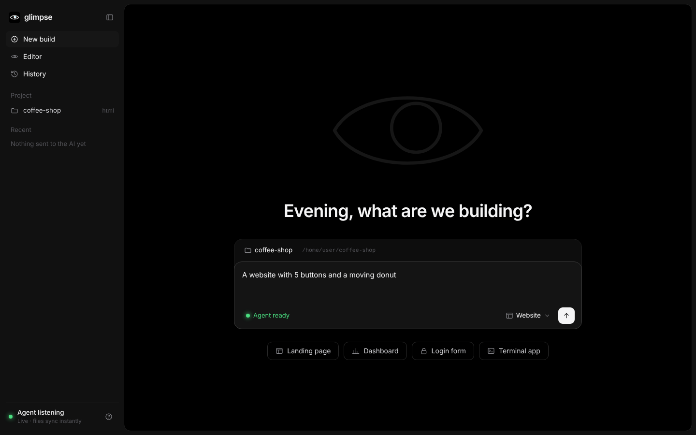
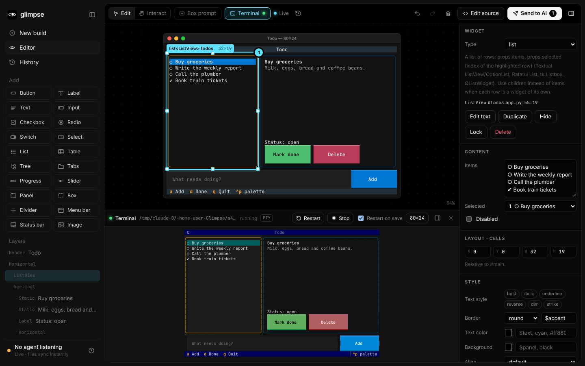
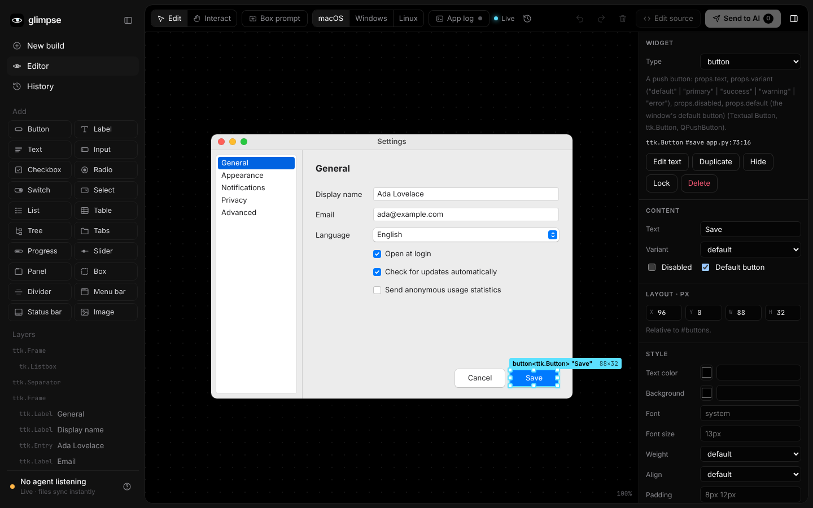

<p align="center">
  
</p>

<p align="center">
  <b>See what your AI built. Change it with your hands. Hand it back.</b><br />
  The visual editing layer between you and your AI coding agent. macOS · Windows · Linux.
</p>

<p align="center">
  
</p>

---

Tell Glimpse what you want, for example *"a website with 5 buttons and a moving donut"*. Glimpse has the AI build it
(Claude Code, Codex or your Claude API key) and you **watch it appear live**. Then, instead of describing changes
in words, you **make** them: drag things around, delete buttons, add new ones, change text and colors, or point at an
element and say what you want. Finally, either let **Glimpse write the changes into the code** itself, or
**send them to your AI**, which applies them 1:1.

<p align="center">
  
</p>

## Features

- **Just type.** Describe a UI on the home screen and Glimpse builds it. It uses Claude Code or Codex if one is installed, otherwise your Claude API key. Nothing to connect.
- **Live mode.** Every file the AI saves shows up instantly. CSS is hot-swapped, HTML is morphed in place without a reload, and whatever the AI touched briefly glows. A live activity feed shows what's happening.
- **Edit anything visually.** Select, drag to move, resize, nudge with the arrow keys, double-click to edit text, delete, duplicate, hide, lock, change the element type, and restyle (colors, font, spacing, radius, border, shadow, opacity).
- **Add elements** (button, heading, text, link, input, image, card). New elements pick up the look of their neighbors.
- **Point & talk.** Select an element, press <kbd>T</kbd>, and type or **say** "make this bounce". The instruction is pinned to that exact element.
- **Edit behavior.** "On click → open modal / go to page / call API / toggle element". Logic instructions go straight to the AI.
- **Two ways to finish:**
  - **Edit source**: Glimpse writes text, style, attribute, delete, add and reorder edits straight into your files, with a diff preview and an automatic backup. Formatting is preserved.
  - **Send to AI**: the AI gets numbered instructions with exact `file:line:col` locations and intent hints such as "now right of the logo", and applies them. Anything Edit source can't do safely (layout moves, logic, notes) is handed to the AI in the same click.
- **History** of every request and handoff, plus **undo/redo**, **desktop / tablet / mobile** widths, and **Edit / Interact** modes.
- **Versions, compare and variants.** Scrub through every version, compare before/after with a slider, and ask for 2–4 variants of an element side by side.
- **Not just web pages.** HTML, **React/Vite** apps (edits written into your JSX), **terminal UIs** and **native desktop GUIs** (an editable mock next to the real app running in Glimpse's terminal). See [Targets](#targets).
- **Desktop app** for macOS, Windows and Linux, or `glimpse open` in the browser. Other agents (Cursor, Gemini CLI, …) can drive Glimpse over its **MCP server** or CLI.

## Install

Works on macOS, Windows and Linux. Pick one:

**npm** (requires [Node.js](https://nodejs.org) 20+)

```bash
npm i -g glimpse-ui     # puts the `glimpse` command on your PATH
glimpse open .

npx glimpse-ui open .   # or run it without installing
```

**Desktop app**

Download the installer for your system from [GitHub Releases](https://github.com/musasacc/Glimpse/releases):
`.dmg` for macOS (Apple Silicon and Intel), `.exe` for Windows (x64 and Arm), `.AppImage` or `.deb` for Linux.
The app opens to a home screen: describe the UI you want and send. Glimpse runs the AI itself (Claude Code, Codex or
a Claude API key) and asks where to save the new project, or builds in the folder you picked; your recent projects are
one click away. External agents can still connect (**Help › Use with an External Agent…**). See
[docs/desktop.md](docs/desktop.md) for first-launch steps and building the app yourself.

**From source** (requires Node.js 20+ and [pnpm](https://pnpm.io))

```bash
git clone https://github.com/musasacc/Glimpse.git
cd Glimpse
pnpm install
pnpm build
cd packages/cli && npm link     # puts the `glimpse` command on your PATH
```

Try it:

```bash
glimpse open examples/donut
```

## The AI

Glimpse picks the AI by itself (**AI settings** in the sidebar to change it):

1. **Claude Code**, if the `claude` command is installed (uses your Claude subscription),
2. **Codex**, if the `codex` command is installed,
3. otherwise the **Direct API**: no agent, Glimpse calls the model itself with a key you paste once in AI settings —
   **Anthropic** (Claude), **OpenAI** (GPT), **Google Gemini**, **OpenRouter** — or a local **Ollama** without a key.
   Keys also come from `ANTHROPIC_API_KEY`, `OPENAI_API_KEY`, `GEMINI_API_KEY` / `GOOGLE_API_KEY` and `OPENROUTER_API_KEY`.

It runs in your project folder, and every file it writes shows up live. Press **Stop** to cancel a run. AI settings
also set the model, the quality (fast, balanced, best), how many steps the Direct API may take, whether Claude Code may
run shell commands, and custom instructions added to every request ("use Tailwind").

## Other agents (MCP)

To drive Glimpse from an agent you already work in instead, add its MCP server. The agent gets the tools `glimpse_open`, `glimpse_wait_for_done`,
`glimpse_get_changes`, `glimpse_status`, `glimpse_update`, `glimpse_close`, and for terminal UIs and native GUIs
`glimpse_scene_schema` and `glimpse_scene_validate`.

If `glimpse` is on your PATH, you can use `glimpse mcp` instead of `npx -y glimpse-ui mcp`.

**Claude Code**

```bash
claude mcp add glimpse -- npx -y glimpse-ui mcp
```

**Codex**: `~/.codex/config.toml`

```toml
[mcp_servers.glimpse]
command = "npx"
args = ["-y", "glimpse-ui", "mcp"]
```

**Cursor** (`.cursor/mcp.json`), **Gemini CLI** (`~/.gemini/settings.json`), **Antigravity** (MCP servers → raw config):

```json
{
  "mcpServers": {
    "glimpse": { "command": "npx", "args": ["-y", "glimpse-ui", "mcp"] }
  }
}
```

> **Windows:** if your agent can't start `npx` directly, use `"command": "cmd", "args": ["/c", "npx", "-y", "glimpse-ui", "mcp"]`.

Then just ask: *"Build me a landing page and open it in Glimpse."* The agent calls `glimpse_open`, builds the page while
you watch, and waits with `glimpse_wait_for_done` for your edits or your next request.

### Without MCP: the CLI

```text
glimpse open [dir]          Start Glimpse for a project (--port, --target, --entry, --run, --no-browser)
glimpse wait [dir]          Block until the human sends a request or edits, then print them (--json, --timeout)
glimpse changes [dir]       Print the most recent handoff again
glimpse status <message>    Show a status line in Glimpse's live activity feed
glimpse mcp                 Run the MCP server over stdio
```

Put this in `CLAUDE.md` / `AGENTS.md` / `GEMINI.md`:

```text
When you build or change UI, use Glimpse so I can edit it visually:
  1. Run `glimpse open <project-dir> --no-browser` in the background (once) and tell me the URL.
  2. Run `glimpse wait <project-dir>`. It blocks until I send a request or my edits from Glimpse.
  3. Do exactly what it prints in the real source code (it includes file:line:col locations).
  4. Go back to step 2.
```

Every handoff is also saved in `<project>/.glimpse/handoffs/<n>.json`. See [`docs/agents.md`](docs/agents.md) for the
change list format.

### What the agent receives

```text
The human edited the html UI in Glimpse. Apply these changes 1:1 to the real source code.
Prefer idiomatic layout changes (flex/grid order, spacing, alignment) over hard-coded pixel positions; use the intent hints.

1. Reposition text<h1> "Donut Shop" (index.html:11:7) — moved 60px right; now above text<p> "Five buttons…".
2. Instruction for button "Order now" (index.html:24:7): "make this bounce"
```

## Targets

| Target | Status | How it works |
|---|---|---|
| HTML / CSS / JS | ✅ Live mode, visual editing, Edit source | The page runs in Glimpse and is edited directly |
| React / Vite | ✅ Live mode (HMR), visual editing, Edit source into JSX | `glimpse open` on a Vite + React project runs the project's own Vite (with its `vite.config`) inside Glimpse, plus a plugin that tags every element with its JSX source. Edit source writes text, style, attribute, add, delete and reorder edits into your components; elements rendered more than once (list items, shared components) and text from props or state go to the AI. Run `npm install` in the project first. Example: [`examples/react-donut`](examples/react-donut) |
| TUI (terminal UIs) | ✅ Editable mock + the real app in a terminal | The agent describes the layout in [`glimpse.scene.json`](docs/scene-schema.md) (Textual, Ink, Ratatui, Bubble Tea, …); Glimpse renders it as an editable character-cell grid, with the real app running in a terminal next to it (`glimpse open --run "python app.py"`, or **Run** in the editor) that restarts when the code changes. Edits are written back into the scene file and handed to the AI for the code. Example: [`examples/tui-todo`](examples/tui-todo) |
| Native GUI (Qt, Tk, …) | ✅ Editable widget mock | Same scene file, rendered as themed widgets in pixels; the real app runs in its own window on demand, its output in Glimpse's log. Example: [`examples/native-settings`](examples/native-settings) |

<p align="center">
  
</p>

<p align="center">
  
</p>

Under the hood, every target becomes the same **Glimpse Scene** (a tree of elements with layout, style and source
locations). The editor, the edit operations and the AI handoff are written once for all of them.

## How it's built

```
packages/
  core/     Scene model, edit operations, undo/redo, change-list diffing, prompt rendering, the scene file format
  server/   Local server: live preview (instrumented with source locations), file watching, handoffs, version history,
            variants, Edit source patcher, scene files, the terminal that runs TUI apps
  react/    React/Vite engine: JSX source locations, the Vite plugin, the preview on the project's own Vite, JSX patcher
  editor/   The black React editor: home, editor, history, compare, variants, and the scene canvas for terminal UIs
            and native GUIs (cell-grid and themed-widget renderers, the xterm.js terminal pane)
  mcp/      MCP server (stdio)
  cli/      The `glimpse` command (npm: glimpse-ui): one bundle with the editor inside
apps/
  desktop/  Electron app for macOS, Windows and Linux (launcher, recent projects, one window per project)
examples/
  donut/            Five buttons and a moving donut (HTML)
  react-donut/      The same as a Vite + React app
  tui-todo/         A Textual todo app with its glimpse.scene.json
  native-settings/  A Tkinter settings window with its glimpse.scene.json
```

- Edits are typed **ops** (`move`, `resize`, `setText`, `setStyle`, `add`, `delete`, `reorder`, `comment`, `behavior`, …) in an op log with undo/redo.
- On handoff, the base and final scenes are **diffed**, so edits that cancel out never reach the AI, and moves come with semantic intent hints.
- The preview is served with `data-glimpse-src="file:line:col"` on every element (parse5 for HTML, Babel for JSX in a Vite plugin). **Edit source** uses those locations to make surgical edits with magic-string, so your formatting stays intact.
- Terminal UIs and native GUIs are described in `glimpse.scene.json`; the real TUI runs in a pseudo-terminal (node-pty, optional; plain pipes without it).
- The server only answers its own pages: other websites can't call its API or open its websocket, and running a command needs the token in `.glimpse/server.json`. The previewed project runs at the editor's origin (the editor reaches into its page), so open projects you would also run: Glimpse keeps the page's own requests away from its API (a browser's API calls need a per-session secret only the editor's page gets), never serves `.git/`, `.env` or other dotfiles nor follows symlinks out of the project, but a page that sets out to can script the editor.
- `.glimpse/` (the token, version history, screenshots) comes with its own `.gitignore`, and files that hold secrets (`.env`, `*.pem`, `*.key`, `id_rsa`, `.npmrc`, …) are never copied into the version history.

## Development

```bash
pnpm install
pnpm build        # builds core, server, editor, mcp, cli
pnpm test         # unit tests
pnpm typecheck
pnpm dev          # editor with hot reload; run `GLIMPSE_DEV_ORIGIN=http://localhost:5173 glimpse open` alongside it on :4321
```

CI runs on macOS, Windows and Linux. See [CONTRIBUTING.md](CONTRIBUTING.md).

## License

[MIT](LICENSE)
