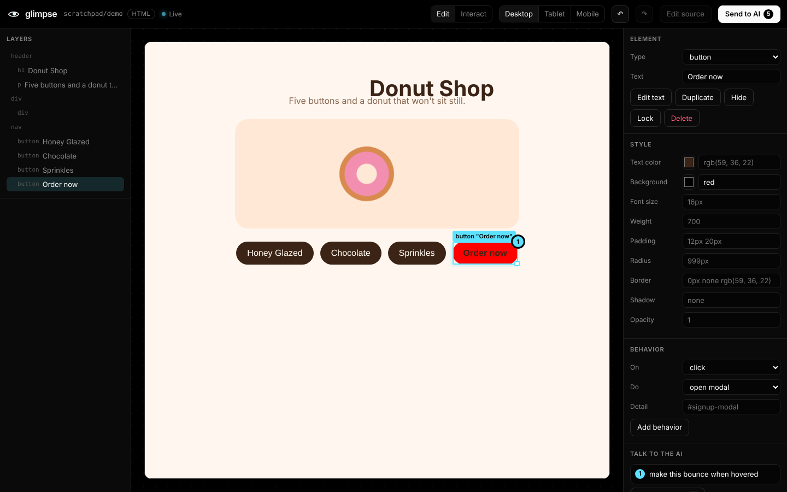

<p align="center">
  
</p>

<p align="center">
  <b>See what your AI built. Change it with your hands. Hand it back.</b><br />
  The visual editing layer between you and your AI coding agent.
</p>

<p align="center">
  
</p>

---

You ask Claude Code, Codex, Antigravity, Cursor or Gemini CLI for *"a website with 5 buttons and a moving donut"*.
The agent builds it, and it opens in **Glimpse**. Instead of describing changes in words, you **make** them:
drag things around, delete buttons, add new ones, change text and colors, or point at an element and say what you want.
Then press **Send to AI**, and the agent applies exactly what you did, 1:1, to the real code. You **watch it happen live**.

## Features

- **Live mode.** Every file your AI saves appears in Glimpse instantly. CSS is hot-swapped, HTML is morphed in place without a reload, and whatever the AI touched briefly glows. A live activity feed shows what's happening.
- **Edit anything visually.** Select, drag to move, resize, nudge with the arrow keys, double-click to edit text, delete, duplicate, hide, lock, change the element type, and restyle (colors, font, spacing, radius, border, shadow, opacity).
- **Point & talk.** Select an element, press <kbd>T</kbd>, and type or **say** "make this bounce". The instruction is pinned to that exact element.
- **Edit behavior.** "On click → open modal / go to page / call API / toggle element". Logic instructions go straight to the AI.
- **Two ways to finish.**
  - **Send to AI**: your agent receives a precise change list (with intent hints such as "now right of the logo") plus your note, and applies it.
  - **Edit source** *(coming next)*: Glimpse writes simple edits straight into your files, with a diff preview.
- **Undo/redo** for everything, plus **desktop / tablet / mobile** widths and an **Edit / Interact** toggle so you can still use the app.
- **Works with any agent.** A tiny CLI (`glimpse wait`) works for every agent today. An MCP server is next.

## Quick start

```bash
# from this repo
pnpm install
pnpm build
node packages/cli/dist/index.js open examples/donut
```

Glimpse opens at `http://127.0.0.1:4321`. Edit the page, then press **Send to AI**.

> Once published, this becomes `npx glimpse open .`

## Using it with your AI agent

Tell your agent (or put this in `CLAUDE.md` / `AGENTS.md`):

```text
When you build or change UI, open it in Glimpse so I can edit it visually:
  1. Run `glimpse open <project-dir> --no-browser` in the background (once) and tell me the URL.
  2. Run `glimpse wait <project-dir>`. It blocks until I press "Send to AI" in Glimpse,
     then prints my changes as numbered instructions.
  3. Apply every instruction 1:1 to the real source code. Optionally post progress with
     `glimpse status "Applying your 4 changes…"`.
  4. Go back to step 2.
```

| Command | What it does |
|---|---|
| `glimpse open [dir]` | Start Glimpse for a project (`--port`, `--target`, `--entry`, `--no-browser`) |
| `glimpse wait [dir]` | Block until the human sends changes, then print them (`--json` for the full change list, `--timeout <sec>`) |
| `glimpse changes [dir]` | Print the most recent handoff again |
| `glimpse status <message>` | Show a status line in Glimpse's live activity feed |

Every handoff is also saved in `<project>/.glimpse/handoffs/<n>.json` (latest: `.glimpse/latest.json`).
See [`docs/agents.md`](docs/agents.md) for per-agent setup and the change list format.

### What the agent receives

```text
The human edited the html UI in Glimpse. Apply these changes 1:1 to the real source code.
Prefer idiomatic layout changes (flex/grid order, spacing, alignment) over hard-coded pixel positions; use the intent hints.

Note from the human: keep the pink brand color

1. Delete button "Maple".
2. Reposition text<h1> "Donut Shop" — moved 100px right and 20px down; now above text<p> "Five buttons…".
3. Change the text of button "Honey Glazed" from "Glazed" to "Honey Glazed".
4. Set style `background: red` on button "Order now".
5. Instruction for button "Order now": "make this bounce when hovered"
```

## Targets

| Target | Status | How it works |
|---|---|---|
| HTML / CSS / JS | ✅ Editing + live mode | The page runs in Glimpse and is edited directly |
| React / Vite | 🔜 | The real dev server runs in Glimpse, and a Vite plugin maps each element to its JSX source |
| TUI (terminal UIs) | 🔜 | The agent describes the layout in `glimpse.scene.json`; Glimpse renders an editable cell grid next to the live terminal |
| Native GUI (Qt, Tk, …) | 🔜 | Same scene file, rendered as an editable widget mock |

Under the hood, every target becomes the same **Glimpse Scene** (a tree of elements with layout, style and source
locations). The editor, the edit operations and the AI handoff are written once for all of them.

## How it's built

```
packages/
  core/     Scene model, edit operations, undo/redo, change-list compaction, prompt rendering
  server/   Local server: preview with live-mode client, file watching, WebSocket, handoff API
  editor/   The all-black React editor (canvas overlay, layers, inspector, activity feed)
  cli/      The `glimpse` command
examples/
  donut/    Five buttons and a moving donut
```

- Edits are typed **ops** (`move`, `resize`, `setText`, `setStyle`, `add`, `delete`, `reorder`, `comment`, `behavior`, …) in an op log with undo/redo.
- On handoff, the base and final scenes are **diffed**, so edits that cancel out never reach the AI, and moves come with semantic intent hints.
- Live mode uses chokidar for file watching, a WebSocket, and a small DOM morph injected into the preview. Your unsent edits are replayed on top of the AI's changes.

## Roadmap

- [x] **Phase 1: foundation.** Monorepo, core model with tests, server, black editor, CLI, live mode, Send to AI, point & talk, behavior.
- [ ] **Phase 2: HTML end to end.** Source locations (parse5), **Edit source** with diff preview, MCP server (`glimpse_open`, `glimpse_wait_for_done`, `glimpse_status`, …), add-from-palette.
- [ ] **Phase 3: loop features.** **Timeline of versions** (scrub and restore), **before/after slider**, **variants** ("show me 3 versions of this header"), draw-a-box prompts, group/align, screenshots in handoffs.
- [ ] **Phase 4: React/Vite.** Vite plugin, JSX source mapping, JSX patcher.
- [ ] **Phase 5: TUI + native GUI.** Scene schema, cell-grid renderer with a live xterm.js view, widget-mock renderer.
- [ ] **Phase 6: polish.** `npx glimpse` on npm, per-agent guides, optional desktop app.

## Development

```bash
pnpm install
pnpm build        # builds core, server, editor, cli
pnpm test         # unit tests (core + server)
pnpm typecheck
pnpm dev          # editor with hot reload (run `glimpse open` alongside it on :4321)
```

See [CONTRIBUTING.md](CONTRIBUTING.md).

## License

[MIT](LICENSE)
